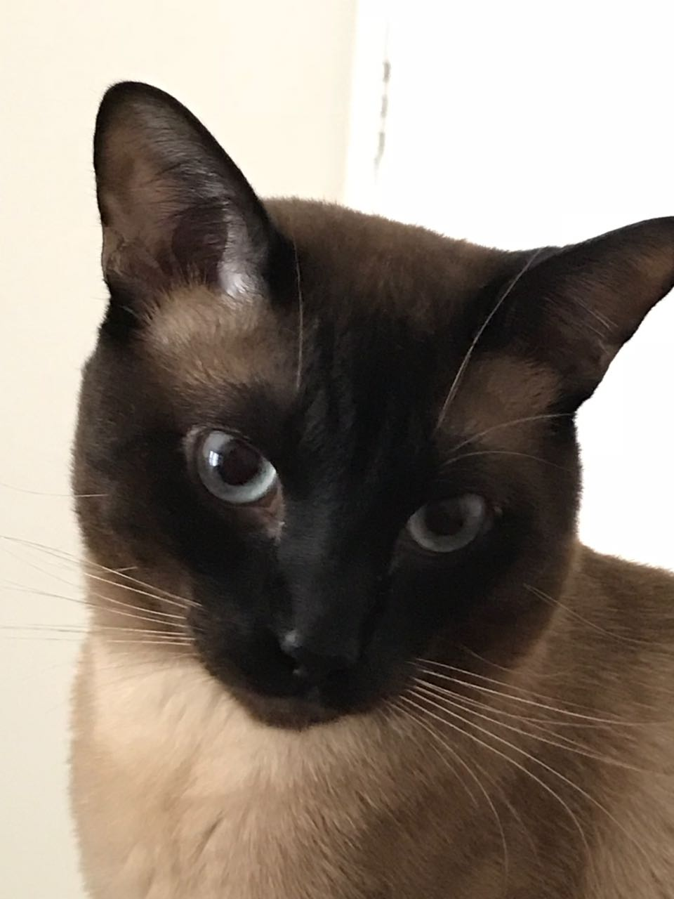
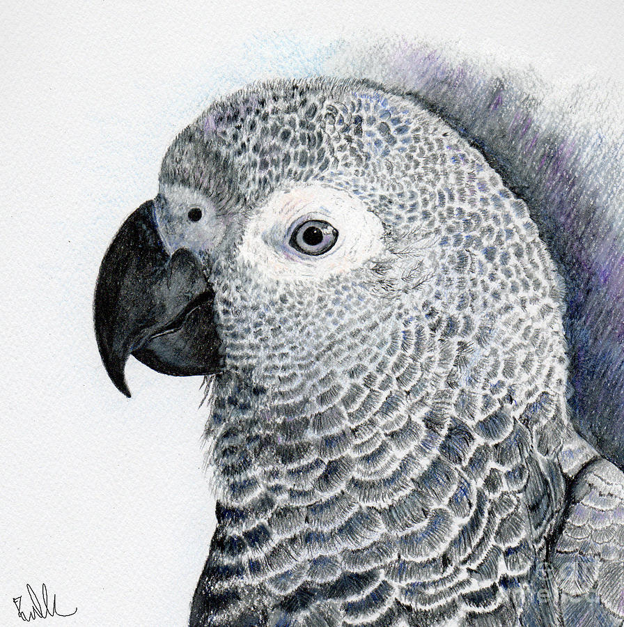
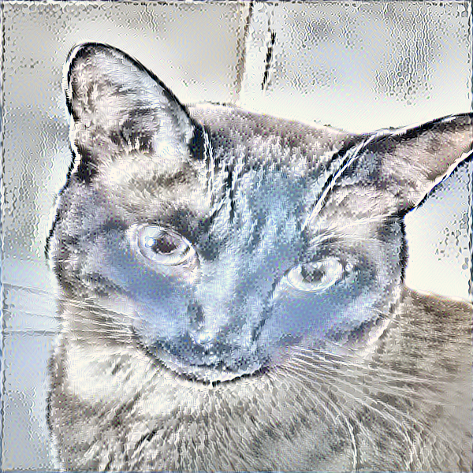

# Neural Style Transfer
Given two images A (content image) and B (style image), the task is to transfer the *style* of image A to that of image B, while being able to preserve the *content* of image A. 
The idea is to start with a random noise image (*input image*), and to update its pixel values so that we minimize both the style and content loss. 
1. **Content Loss** is computed as the pixel wise mean squared error between the transformations of image A and the input image, after sending it through VGG-16 and extracting the feature map at the end of Conv Block 4.
2. **Style Loss** is calculated as follows: First we compute the gram matrix (product of a matrix with its transpose) of the transformed feature maps (at the end of each conv block) of image B after it is send through the VGG-16 network. The same is done for the noise input image. Finally, we compute the MSE between the resulting gram matrices; then take a weighted summation of the losses at the end of each conv block. 

The total loss is then calculated as **L = SL + lambda * CL**, where lambda is a hyperparameter that decides the level of content to be preserved.  

Note that VGG-16 with average pooling was used so that the image is not downsampled. Also the BFGS optimizer from `scipy` was utilized.   

## Requirements
Keras==2.0.8  
tensorflow-gpu==1.3.0  
Pillow==4.1.1  
scipy==0.19.0  
numpy==1.12.1  

## Instructions
- Specify the source and style image paths, and other configurations in `config.py`
- Run `run_style_transfer.ipynb` in a cell-by-cell manner, the output at each iteration is saved in `images/results/`
Refer to `style-transfer-vgg.ipynb` notebook for step by step procedures and detailed notes.

## Results
**Source Image:**
 

 

**Style Image:**
 

 

**Stylized Version of Source Image:**
 

 

## Acknowledgements
This project was done following the lecture materials of the [fast.ai course](http://course.fast.ai/lessons/lesson8.html) offered by Jeremy Howard.
